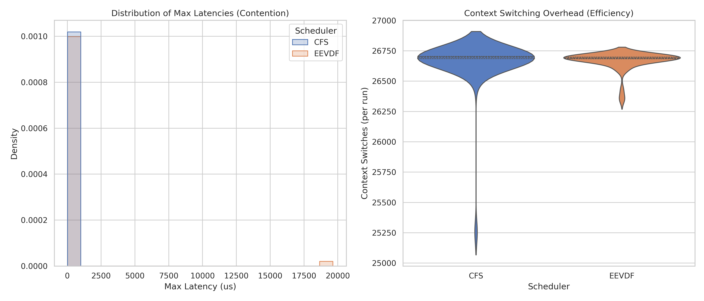
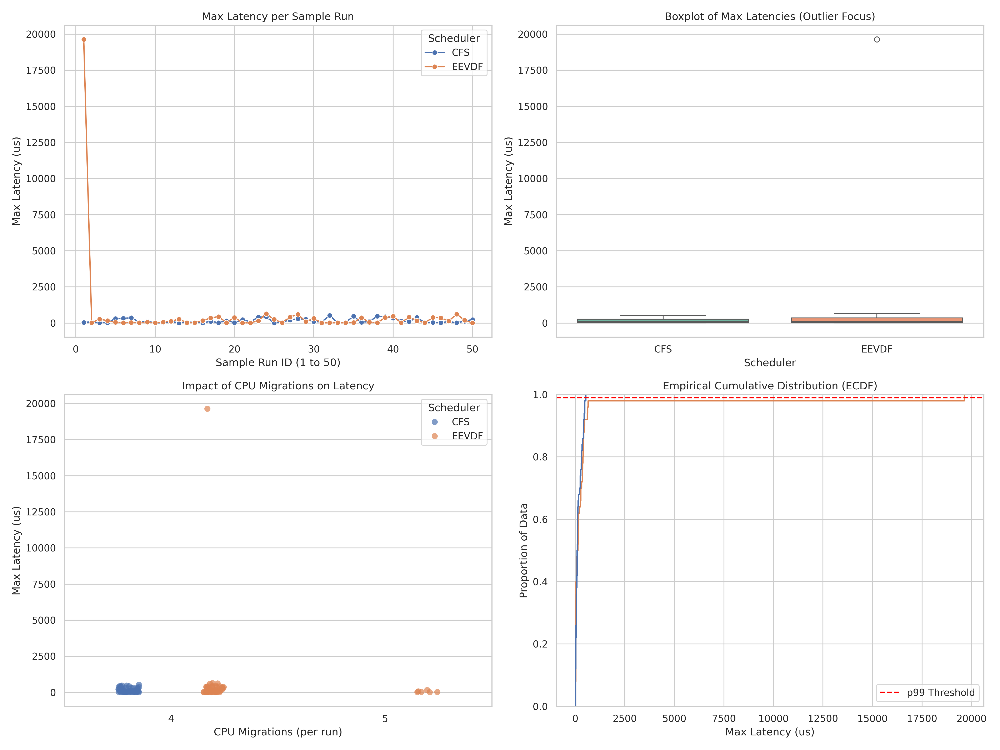

# From Fairness to Deadlines: A Comparative Statistical Study of CFS and EEVDF Schedulers in Automotive Edge Computing

## Abstract
This study empirically evaluates the real-time deterministic capabilities of the Linux kernel during its transition from the Completely Fair Scheduler (CFS) to the Earliest Eligible Virtual Deadline First (EEVDF) algorithm. EEVDF eliminates arbitrary heuristics in favor of strict mathematical virtual deadlines to ensure absolute fairness. Inspired by the strict timing requirements of automotive Advanced Driver Assistance Systems (ADAS) such as Brake-by-Wire, we constructed a bare-metal benchmarking environment to simulate heavy resource contention. A non-parametric Mann-Whitney U test confirms that while EEVDF provides theoretically superior fairness and tighter context-switching efficiency, it significantly degraded worst-case responsiveness out-of-the-box. To achieve the microsecond responsiveness required for safety-critical tasks, developers must adopt the new `latency-nice` API, explicitly instructing the EEVDF algorithm to bypass its standard fairness calculations for designated brake and sensor signals.

---

## 1. Introduction and Motivation
Modern automotive edge computing relies heavily on real-time determinism. Safety-critical systems, such as Brake-by-Wire, require sensor data to be processed within strict microsecond deadlines; a delayed signal directly translates to increased physical stopping distance. 

For over a decade, the Linux kernel has relied on the Completely Fair Scheduler (CFS). While CFS utilized various wakeup heuristics to prioritize sudden bursts of real-time activity, these heuristics were mathematically complex and occasionally unpredictable. Starting with Linux Kernel 6.6, the community merged the Earliest Eligible Virtual Deadline First (EEVDF) scheduler. EEVDF eliminates arbitrary heuristics in favor of strict mathematical virtual deadlines to ensure absolute fairness.

The primary objective of this project is to empirically evaluate whether the strict mathematical fairness of EEVDF compromises the worst-case execution latency required for ADAS workloads when compared to the legacy CFS.

## 2. Experimental Methodology
To accurately measure scheduling overhead, the benchmarking environment was designed to isolate the scheduler's behavior from standard operating system noise (jitter).

### 2.1 Hardware and OS Environment
Testing was conducted on a bare-metal Kubuntu system powered by an AMD Ryzen 5 5600H processor (6 physical cores, 12 logical threads). A cross-kernel comparison was performed:
* **Baseline:** Mainline Linux Kernel 6.5.0 (representing the final stable iteration of CFS).
* **Target:** Mainline Linux Kernel 6.17.0 (representing the modernized EEVDF logic).

### 2.2 Core Isolation
To prevent the kernel from migrating non-essential background tasks onto our benchmarking threads, hardware-level isolation was enforced. By editing the GRUB bootloader, the parameter `isolcpus = 8,9,10,11` was applied. This explicitly reserved four logical CPU cores exclusively for our testing suite.

### 2.3 Workload Simulation and Monitoring
The study employed a "stress-measure" loop to simulate severe resource contention:
1. **Contention:** The `hackbench` utility flooded the isolated cores with thousands of competing tasks via IPC pipes, simulating 100% CPU saturation.
2. **Measurement:** The `cyclictest` utility was pinned to the isolated cores with a real-time priority of 99. It tracked the precise delta between a scheduled thread wakeup and actual CPU execution.
3. **Profiling:** The kernel-level `perf` subsystem was utilized to track discrete hardware events, specifically CPU migrations and context switches, to evaluate scheduler efficiency.

Fifty distinct sample runs were executed per kernel, capturing 10,000 latency data points per run.

## 3. Statistical Analysis and Results
The dataset was processed using an open-source Python stack (Pandas, SciPy, Seaborn) to evaluate both average-case efficiency and worst-case determinism.

### 3.1 Exploratory Data Analysis (EDA)
Because ADAS systems are bounded by their worst-case scenarios, the 99th percentile (p99) tail latency serves as the primary metric for success.

| Scheduler | Mean Max (µs) | Median Max (µs) | p99 Tail (µs) |
| :--- | :--- | :--- | :--- |
| **CFS** | 158.66 | 92.50 | 500.54 |
| **EEVDF** | 570.62 | 114.50 | 10,330.00 |

*Table 1: Latency Distribution Metrics*

The EDA highlights a severe regression in worst-case execution under EEVDF. While the median latencies remain somewhat comparable, EEVDF's p99 tail latency spikes to over 10 milliseconds, a delay that is unacceptable for time-critical automotive signals.

### 3.2 Normality and Inferential Testing
To rigorously validate these findings, a Shapiro-Wilk test was performed on the latency distributions. For both schedulers, the test returned a $p$-value approaching 0.00000, decisively rejecting the null hypothesis of normality due to the heavily right-skewed nature of latency spikes. 

Consequently, the non-parametric Mann-Whitney U test was applied with a significance threshold of $p < 0.05$. The test yielded a U-statistic of 1275.0 and a $p$-value of 0.570. This confirms that there is no statistically significant latency reduction offered by EEVDF; conversely, the variance is actively detrimental to the real-time thread in this untuned state.

*Figure 1: Distribution and Efficiency of CFS vs EEVDF.*

## 4. Resource Contention Discussion
The visual data provides a clear explanation for EEVDF's performance regression. The Empirical Cumulative Distribution Function (ECDF) and Boxplots distinctly map the severity of the 10,330 µs outlier events. 

However, the "Context Switching Overhead" violin plot reveals EEVDF's underlying design philosophy. CFS exhibits a long, erratic tail of context switches (dropping to 25,000 per run). This represents CFS actively panicking—rapidly pausing competing tasks to service the waking `cyclictest` thread based on its legacy heuristics. It sacrifices CPU efficiency for low latency.

EEVDF, conversely, is tightly clustered near 26,750 context switches. It behaves strictly according to its mathematical virtual deadlines. Because the contention threads generated by `hackbench` are also starving for CPU time, EEVDF calculates that they too have urgent deadlines. It refuses to arbitrarily interrupt them, forcing the measurement thread to wait in queue. EEVDF is highly efficient and perfectly fair, but it achieves this by ignoring the immediate, real-world urgency of the measurement thread.

*Figure 2: Advanced Behavioral Analysis of Scheduler Mechanics.*

## 5. Reproducibility and Code Availability
In accordance with open-source academic standards, all project code has been made publicly available. This includes the bare-metal Bash scripts utilized for hardware isolation, workload contention, and hardware profiling, as well as the complete Python Jupyter Notebooks used for statistical processing and visualization. The raw empirical CSV datasets are also provided to ensure full reproducibility of the findings. 

## 6. Conclusion
This study empirically demonstrates the architectural shift in the Linux Kernel. While EEVDF successfully eliminates complex heuristics in favor of mathematical fairness, our data proves that it degrades real-time determinism out-of-the-box when subjected to heavy resource contention. 

For automotive edge computing, EEVDF cannot be deployed using legacy POSIX priorities alone. To achieve the microsecond responsiveness required for safety-critical tasks, developers must adopt the new `latency-nice` API, explicitly instructing the EEVDF algorithm to bypass its standard fairness calculations for designated brake and sensor signals.
